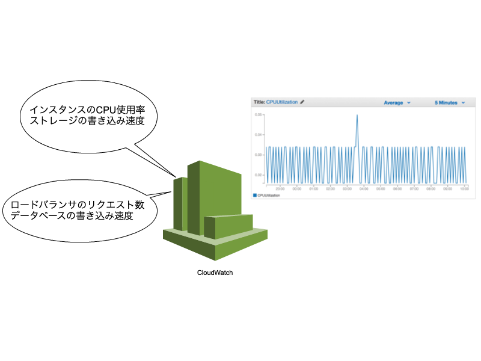

layout: true
class: center, middle

---
background-image: url(images/asg.png)
# オートスケーリンググループはともだち、こわくないよ
### 神戸デジタル・ラボ インフラ勉強会 AWS勉強会(初心者向け) #1 2016/07/28 中山 幸治

---
# 自己紹介

---
# 中山 幸治(knakayama)&nbsp;
### [https://knakayama.github.io](https://knakayama.github.io)
### 

---
# クラスメソッド AWSコンサルティング部 所属

---
background-image: url(http://cdn.dev.classmethod.jp/wp-content/uploads/2016/06/new_osaka_office_front_800-e1465205568251.jpg)
**クラスメソッド 大阪オフィス 爆誕**

---
background-image: url(http://cdn.dev.classmethod.jp/wp-content/uploads/2016/06/new_osaka_office_front_800-e1465205568251.jpg)
**肥後橋駅から 徒歩1分**

---
background-image: url(http://cdn.dev.classmethod.jp/wp-content/uploads/2016/06/new_kaigishitsu-e1465281377447.jpg)
**日当り良好**

---
background-image: url(http://cdn.dev.classmethod.jp/wp-content/uploads/2016/06/new_office_naka-e1465280928774.jpg)
**おしゃれ系 オフィス**

---
background-image: url(images/osaka-office.png)

---
background-image: url(http://cdn.dev.classmethod.jp/wp-content/uploads/2016/06/new_office_naka-e1465280928774.jpg)
**おしゃれ系 オフィス**

---
background-image: url(images/osaka-members.png)

---
background-image: url(images/osaka-members.png)
**メンバーは まだ4人だけ (2016年7月)**

---
**絶賛人材 募集中**

---
**こんな話聞いてる場合じゃない**

---
background-image: url(http://cdn.dev.classmethod.jp/wp-content/uploads/2016/07/mesoko_01.png)
## http://classmethod.jp/recruit/jobs/

---
background-image: url(http://cdn.dev.classmethod.jp/wp-content/uploads/2016/07/mesoko_01.png)
**絶賛人材 募集中**
## http://classmethod.jp/recruit/jobs/

---
# 今日の資料↓に置いときました
### [https://knakayama.github.io/slide-2016-07-28](https://knakayama.github.io/slide-2016-07-28)
### 「knakayama」とかでググれば出てくると思います

---
layout: true
class: center, middle

---
# アジェンダ

---
layout: true
class: middle

---
## 1. オートスケーリンググループの基本
## 2. オートスケーリンググループの詳細
## 3. オートスケーリンググループの注意点
## 4. もっと知りたい方へのおすすめリンク

---
layout: true
class: center, middle

---
# 1. オートスケーリンググループの基本

---
# 唐突ですが こんな経験無いですか?

---
# アクセス増加で Webサーバが落ちた

---
### 通常のアクセス数の場合  

---
### アクセスが急増した場合  

---
# それ、オートスケーリンググループで解決できます
### # 一部を除く

---
# 改めてオートスケーリンググループとは?

---
# オートスケーリンググループ  ==  「オートスケール」するインスタンスの集まり(グループ)

---
# オートスケール?

---
> *オートスケールは、クラウドコンピューティングで利用しているサーバーなどの台数を自動的に増減する技術、あるいはサービス。*

### http://www.nttpc.co.jp/yougo/オートスケール.html

---
# オートスケーリンググループ  ==  オートスケール(自動で増減) するインスタンスの集まり(グループ)

---
layout: true
class: middle

---
### - インスタンスを増加させる == スケールアウト
### - インスタンスを減少させる == スケールイン
### - オートスケーリンググループ == Auto Scaling Group == ASG

---
layout: true
class: center, middle

---
# 2. オートスケーリンググループの詳細

---
layout: true
class: middle

---
## 2-1. 起動設定(ローンチコンフィギュレーション)
## 2-2. スケーリングポリシー
## 2-3. ヘルスチェック
## 2-4. インスタンスの起動数

---
layout: true
class: center, middle

---
# 2-1. 起動設定

---
layout: true
class: middle

---
### - オートスケーリンググループで起動させるインスタンスの設定
### - どういったインスタンスで起動させるかを指定する
### - 例: メモリは1GB、ストレージは8GB、etc...
### - 1つのオートスケーリンググループには必ず1つの起動設定を指定する
### - オートスケーリンググループの作成時やスケールアウトする時にこの起動設定に基づいたインスタンスが起動する

---
layout: true
class: center, middle

---
# 2-2. スケーリングポリシー

---
# その前にCloudWatchの解説

---
layout: true
class: middle

---
### - AWSの「監視」サービス
### - AWSのさまざまなメトリクスを収集(CloudWatch Metrics)
### - 集めたメトリクスのアラート設定が可能(CloudWatch Alarm)
### - アラート検知時に特定のアクションを実行可能(通知など)
### - 収集したメトリクスは2週間しか保存されない(それ以上保持したい場合は別の仕組みが必要)

---
layout: true
class: center, middle

---
### CloudWatch Metricsのイメージ

---
### CloudWatch Alarmのイメージ  

---
# 改めてスケーリングポリシーについて

---
layout: true
class: middle

---
### - どういった条件でスケールさせるかという設定
### - CloudWatchとひも付けることができる
### - メトリクスの閾値を超過した場合にスケールさせることが可能
### - 例: CPU使用率が上がったのでスケールアウト
### - 例: アクセスが減少したのでスケールイン

---
layout: true
class: center, middle

---
### CloudWatchとオートスケーリンググループの連携  

---
# 2-3. ヘルスチェック

---
layout: true
class: middle

---
### - オートスケーリンググループはグループ内のインスタンスの状態を常にチェックしている(ヘルスチェック)
### - ヘルスチェックに失敗したインスタンス(unhealthy)は作り変えられる
### - つまりそのインスタンスは消去されて別のインスタンスを起動させようとする
### - こうすることでグループ内のインスタンスが常に正常に動作することを保証できる

---
### - ヘルスチェックの方法は3つある(EC2/ELB/カスタム)
### - この内もっともよく使うのはELB(L3レベルのロードバランサ)のヘルスチェック
### - ELBとオートスケーリンググループを紐付ける
### - ELBからオートスケーリンググループに対して定期的にアクセスして期待した結果が返ってくるかチェックする
#### ヘルスチェック（Auto Scaling インスタンス対象） https://docs.aws.amazon.com/ja_jp/AutoScaling/latest/DeveloperGuide/healthcheck.html

---
layout: true
class: center, middle

---
### ヘルスチェックのイメージ図(ELB)   

---
# 2-4. インスタンスの起動数

---
layout: true
class: middle

---
### - オートスケーリンググループはどれくらいインスタンスを起動したいかを以下の値で指定できる
### - max(最大起動数) -> 最大でもこの数しか起動しない
### - min(最低起動数) -> 最低でもこの数は起動させようとする
### - desired(希望起動数) -> 常にこの数を起動させようとする

---
### - maxが3 -> スケールアウトしてもインスタンス数を3つ以上には増加させない
### - minが1 -> スケールインしてもインスタンス数を最低1つ維持しようとする
### - desiredが2 -> インスタンスの数を常に2つに維持しようとする

---
### - max/min/desiredの数を変更すれば手動でスケールさせることも可能
### - オートスケーリンググループだからといってスケーリングポリシーを設定しないといけないわけではない
### - スケーリングポリシーは必要ないが、オートスケーリンググループを利用したほうが良いシステムは存在する

---
### - オートスケールはしなくてもいいが常に1台起動させたい場合
### - 例えば、踏み台用サーバなどのように常に起動しておいて欲しいがクリティカルな役割でもないもの
### - max/min/desiredを全て1にするとインスタンスがヘルスチェックに失敗しても自動で新しく作り変えてくれる
### - オートヒーリングパターン
#### http://www.slideshare.net/kazukiueki76/20130823-cloudpacknight-lt

---
layout: true
class: center, middle

---
# 3. オートスケーリンググループの注意点

---
layout: true
class: middle

---
### - 急激にアクセスが増加した場合スケールアウトが間に合わない時がある
### -> アクセスされる時間が把握できる場合はmax/min/desiredを調整して事前にインスタンスを手動スケールアウトさせておく
### -> ELBの暖気申請も忘れずに
#### Elastic Load Balancing の暖申請について http://dev.classmethod.jp/cloud/aws/elastic-load-balancing-pre-warming/

---
### - インスタンスが起動するだけでサービスインできる仕組みを整えておく必要がある
### -> そうしないとスケールアウトしたときに使いものにならないインスタンスが起動してしまうため
### -> ユーザデータでシェルスクリプト/Ansible/etcを実行して必要な設定を投入しておく
#### プロビジョニングの今 ーフルマネージド・サービスを目指してー http://www.slideshare.net/shuji_w6e/ss-58485223

---
### - スケールインしてインスタンスが消去されても問題ない構成にしておく必要がある
### -> つまりインスタンスにデータを持たせない(ステートレス)構成にしておく必要がある
### -> 重要なデータを持ったインスタンスが勝手に消去されたら困るため
### -> ログはfluentdなどのツールを使ってS3に保管しておくこと

---
layout: true
class: center, middle

---
# 4. もっと知りたい方へのおすすめリンク

---
layout: true
class: middle

---
### - AWS Black Belt Techシリーズ Amazon CloudWatch & Auto Scaling
#### http://www.slideshare.net/AmazonWebServicesJapan/aws-black-belt-tech-amazon-cloudwatch-auto-scaling
### - Amazon CloudWatch の名前空間、ディメンション、メトリックスのリファレンス
#### https://docs.aws.amazon.com/ja_jp/AmazonCloudWatch/latest/DeveloperGuide/CW_Support_For_AWS.html
### - AWSのオートスケールとなかよく付き合う
#### https://speakerdeck.com/fujiwara3/awsfalseotosukerutonakayokufu-kihe-u
### - Developers.IO
#### http://dev.classmethod.jp/

---
### - スケジュールに基づくスケーリング
#### https://docs.aws.amazon.com/ja_jp/AutoScaling/latest/DeveloperGuide/schedule_time.html
### - ASGとスポットインスタンスの連携
#### http://www.slideshare.net/GedowFather/gedow-style-aws-spot-instance
### - スポットフリート
#### http://docs.aws.amazon.com/ja_jp/AWSEC2/latest/UserGuide/spot-fleet.html
### - オートスケール時にSNSへ通知させる
#### http://docs.aws.amazon.com/ja_jp/AutoScaling/latest/DeveloperGuide/ASGettingNotifications.html

---
layout: true
class: center, middle

---
# 注意点もあるけど

---
# それでも

---
background-image: url(images/asg.png)
# オートスケーリンググループはともだち、こわくないよ

---
background-image: url(http://cdn.dev.classmethod.jp/wp-content/uploads/2016/07/mesoko_01.png)
**絶賛人材 募集中**
## http://classmethod.jp/recruit/jobs/

---
# おわり
